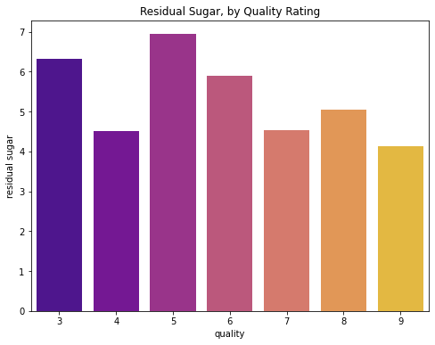
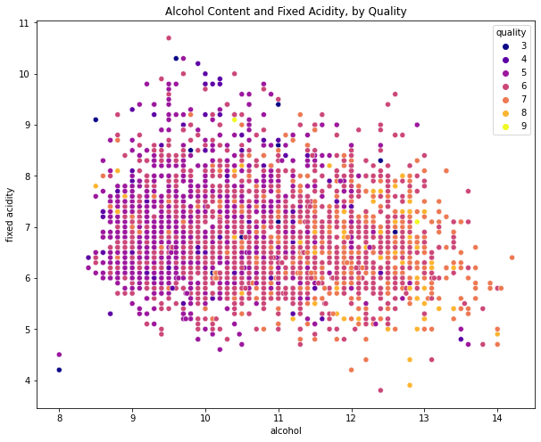

# White Wine Quality
## Analysis of the Portuguese white wine, Vinho Verde.

**Author**: Laura Dimaria

### Business problem:

To analyze the relationship between physiochemical properties of wine in relation to its quality rating

### Data:
For this project, we used the white wine quality dataset, found on kaggle.com

Source : https://www.kaggle.com/datasets/piyushagni5/white-wine-quality

## Methods
- Data was prepared using Pandas. Our dataset was already fairly clean, we only had to drop duplicates. During this I noticed some data that could possibly be outliers and made note to explore that during visualizations, in case it needed to be cleaned up.
- Using MatPlotLib, we explored our data visually. Here, I was able to see and drop a fair amount of outliers in a few caterogies, but nothing that wouuld drastically change the landscape of the data.
- Lastly, we used SciKitLearn to scale, encode, and model our data using classification methods.

## Results

#### Residual Sugars, by Quality Rating

#### Alcohol Content and Fixed Acidity, by Quality Rating

## Model

For our final production model, I would chose a Random Forest Classifier, paired with feature engineering and GridSearchCV for hypertuning.

Due to the nature of wine, and how unpredicatable it can be, this model did not score well. With more work and less classes of quality, I believe the model could preform well.

## Recommendations:

Realistically, I should have binned the target column into three bins, poor, average, and excellent. While this would not have helped the data be more evenly distributed, it would have help lump the data into less classes and probably helped the model learn more about the poor and excellent classes as opposed to having 7 different ones of varying weights.

## Limitations & Next Steps

I would like to continue working on this project as my knowledge and skillset grows and becomes more refined.

### For further information

For any additional questions, please contact **laura.e.dimaria@gmail.com**
